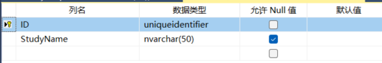
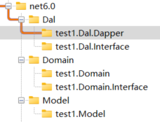

# apstory-tsql-code-gen
T-SQL, Model, Dapper DAL &amp; Domain .NET Code Generation

这真是一个糟糕 的开源项目，没有使用说明，很多bug，慢慢调试了一天才通，可以生成文件，生成出来的文件也用不了，很多错，生成的代码试图用存储过程做增删改查，很多错误之处，这错误量不比我自己写一个省事多少，我不打算用它了，谁爱用谁用吧

## 效果 ##

生成的代码放在generation文件夹

